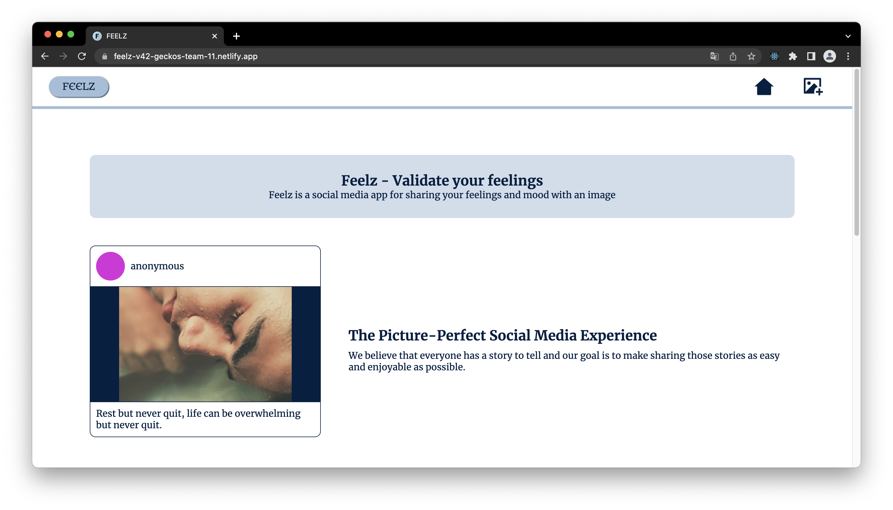
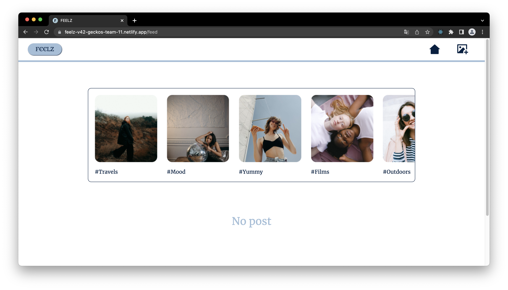
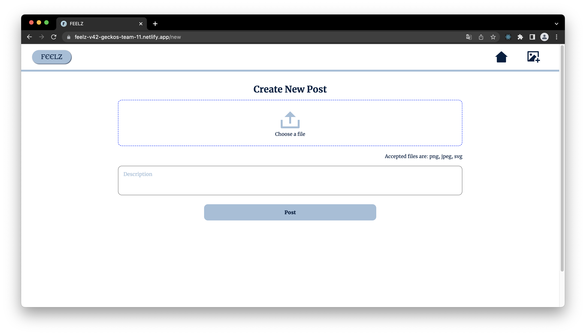
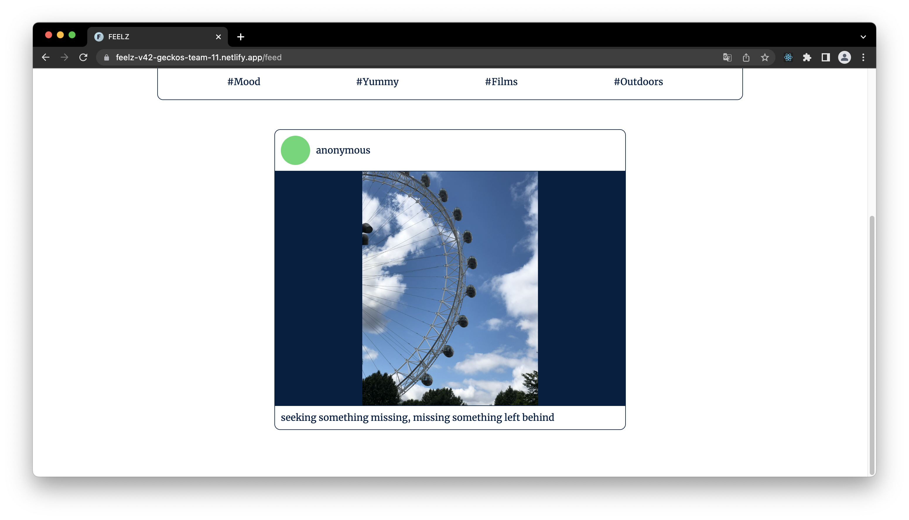

## Feelz

Feelz is a web application that allows users to express their feelings visually by posting images and attaching a short description. This application updates just like the feeds of a social media application to accomodate your different posts. This project was built by the Gecko-team-11 of the Chingu voyage-42 - a platform that allows collaboration amongst web developers across the globe. This platform is an avenue to enhance and learn technical skills while building hands-on project.

## Built with

- React.js
- React Routers
- Swiper.js
- CSS
- Firebase

## Screenshots

## Authors

- Jiwon Moon
  - [Linkedin](https://www.linkedin.com/in/mjiwon/)
  - [Github](https://github.com/jwzzang12)

- Aghasua Kator Jason
  - [Linkedin](https://www.linkedin.com/in/katoragashua)
  - [Github](https://github.com/katoragashua)

- Atoyebi Oluwakemi
  - [Linkedin](https://www.linkedin.com/in/oluwakemi-atoyebi)
  - [Github](https://github.com/Khemmie-Ray)

- Thierno Sadou
  - [Linkedin](https://www.linkedin.com/in/sadujallow)
  - [Github](https://github.com/thierved)
